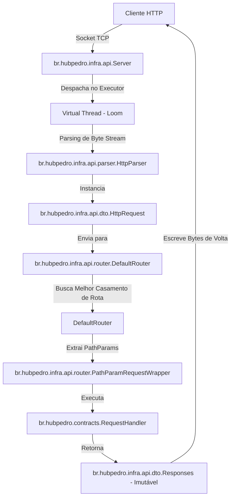
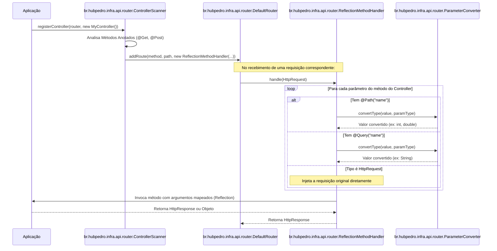

# 🚀 FastAPI-like Java Framework (Loom Sandbox)

> **"E se a simplicidade e a ergonomia declarativa do FastAPI (Python) fossem unidas com a robustez de tipos do Java 21 moderno e o poder de escalabilidade das Virtual Threads?"**

Este projeto é uma biblioteca Java inovadora, inspirada diretamente na ergonomia minimalista e produtiva do **FastAPI**, mas construída de forma puramente idiomática para o **Java 21+**. Sob o capô, ela traz um servidor HTTP nativo baseado em sockets de alta performance, alimentado pelas **Virtual Threads (Project Loom)**, além de um roteador avançado e um mecanismo reflexivo de controladores anotados extremamente expressivo.

---

## 🧭 Princípios de Design e Arquitetura

O framework foi projetado seguindo diretrizes rígidas de separação de conceitos, ergonomia e segurança concorrente:

* **Contratos Públicos Limpos**: Toda a complexidade de rede, parsing de bytes e reflexão é mantida estritamente dentro do pacote `infra`. O usuário final interage apenas com interfaces em `contracts` e fachadas públicas como [FastApi](file:///c:/Users/pfbrodrigues/OneDrive/git/fastapi/fastapi/src/main/java/br/hubpedro/infra/api/FastApi.java) e `Responses`.
* **Segurança Concorrente (Thread-Safety)**: O roteador e os manipuladores de requisições são thread-safe por padrão. Os objetos de requisição e resposta são 100% imutáveis, garantindo que o estado não seja corrompido em cenários de altíssima concorrência.
* **Leve e Sem Dependências Externas**: Zero Spring Boot, zero Jakarta EE, zero Quarkus. Rodando inteiramente com bibliotecas padrão do Java 21+.

---

## 🎨 Principais Recursos

### 1. Project Loom & Servidor de Alta Performance
Cada conexão HTTP de cliente é capturada por uma thread aceitadora assíncrona dedicada e despachada instantaneamente para um executor de Virtual Threads ([Executors.newVirtualThreadPerTaskExecutor()](file:///c:/Users/pfbrodrigues/OneDrive/git/fastapi/fastapi/src/main/java/br/hubpedro/infra/api/Server.java#L53)).
* **Sem Bloqueio de Threads de S.O.**: Operações de entrada/saída (I/O) de rede bloqueiam apenas a Virtual Thread corrente, liberando a thread portadora física para processar outras requisições.
* **Graceful Shutdown**: Mecanismo que interrompe o recebimento de novas conexões, mas concede até **10 segundos** para que requisições ativas sejam finalizadas e persistidas de forma segura.

### 2. Roteamento Inteligente e Livre de Conflitos
Implementado por [DefaultRouter](file:///c:/Users/pfbrodrigues/OneDrive/git/fastapi/fastapi/src/main/java/br/hubpedro/infra/api/router/DefaultRouter.java), o sistema de roteamento traz recursos maduros de servidores enterprise:
* **Ordenação Segment-by-Segment**: Assegura que rotas estáticas exatas (ex: `/items/search`) sejam priorizadas em relação a rotas dinâmicas genéricas (ex: `/items/{id}`), eliminando bugs comuns de sombreamento, independentemente da ordem em que foram registradas.
* **Escape Seguro de Caracteres**: Símbolos reservados da Regex em caminhos estáticos são escapados automaticamente.
* **Tratamento do Erro 405 (Method Not Allowed)**: Se um recurso existir mas for requisitado via um método HTTP não suportado, o roteador responde automaticamente com status `405` e insere o cabeçalho `Allow` contendo os verbos aceitos.

### 3. Parser HTTP Resiliente e Proteção DoS
O [HttpParser](file:///c:/Users/pfbrodrigues/OneDrive/git/fastapi/fastapi/src/main/java/br/hubpedro/infra/api/parser/HttpParser.java) trabalha a nível de bytes, permitindo:
* Suporte completo e perfeito a codificações de texto acentuado e Emojis 🚀 sem travamento de requisições.
* Limites rígidos integrados contra ataques DoS: tamanho máximo de cabeçalho limitado a **8 KB** e corpo limitado a **10 MB**.

### 4. Dois Modelos de Programação: Funcional e Declarativo
Você pode escolher a forma como deseja declarar suas APIs:
* **Modelo Funcional (Lambdas)**: Rápido, leve e direto.
* **Modelo Declarativo (Controladores Anotados)**: Ergonomia no estilo FastAPI, com anotações intuitivas, escaneamento reflexivo automático e conversão implícita de tipos.

---

## 📊 Arquitetura de Fluxo do Sistema

Abaixo é possível visualizar a jornada de uma requisição HTTP, desde o recebimento da conexão até a execução dos Handlers:

### Fluxo de Conexão e Processamento de Requisições


### Escaneamento de Controladores e Injeção de Parâmetros
O escaneamento reflexivo automatizado faz o bind transparente dos parâmetros informados nas rotas para variáveis Java fortemente tipadas:


---

## ⚡ Como Usar o Framework

### A. Modelo Declarativo (Recomendado)
Crie classes normais de controle anotadas com `@Get` ou `@Post`. Os parâmetros são preenchidos automaticamente por meio de `@Path` e `@Query`.

```java
package br.hubpedro.controller;

import br.hubpedro.contracts.HttpRequest;
import br.hubpedro.contracts.HttpResponse;
import br.hubpedro.contracts.annotations.Get;
import br.hubpedro.contracts.annotations.Path;
import br.hubpedro.contracts.annotations.Post;
import br.hubpedro.contracts.annotations.Query;
import br.hubpedro.infra.api.dto.Responses;

public class UserController {

    // 1. Endpoint com conversão implícita de tipos (Path e Query Params)
    @Get("/users/{id}")
    public HttpResponse getUser(@Path("id") int id, @Query("q") String query) {
        return Responses.ok("Buscando usuário: " + id + " com o filtro: " + query);
    }

    // 2. Endpoint recebendo diretamente o objeto da requisição HTTP e corpo
    @Post("/users")
    public HttpResponse createUser(HttpRequest request) {
        String body = request.getBody();
        return Responses.builder()
                .status(201)
                .body("Usuário criado com sucesso! Payload: " + body)
                .build();
    }
}
```

Para registrar o controlador no servidor:
```java
Router router = FastApi.newRouter();
FastApi.registerController(router, new UserController());
```

---

### B. Modelo Funcional (Estilo Micro-Framework)
Você também pode declarar rotas diretamente na inicialização de sua aplicação usando expressivas lambdas:

```java
import br.hubpedro.contracts.Router;
import br.hubpedro.infra.api.FastApi;
import br.hubpedro.infra.api.dto.Responses;

public class App {
    public static void main(String[] args) {
        Router router = FastApi.newRouter();

        // Rota simples retornando HTML
        router.get("/", request -> Responses.builder()
                .status(200)
                .header("Content-Type", "text/html; charset=UTF-8")
                .body("<h1>🚀 FastAPI Java - Virtual Threads ativo!</h1>")
                .build()
        );

        // Acesso a parâmetros de caminho e de busca
        router.get("/items/{id}", request -> {
            String itemId = request.getPathParams().get("id");
            String filter = request.getQueryParams().getOrDefault("filter", "none");
            return Responses.json(String.format("{\"id\": %s, \"filter\": \"%s\"}", itemId, filter));
        });
    }
}
```

---

## 📦 Como Inicializar e Subir o Servidor

Veja o ciclo de vida completo no arquivo principal [Main.java](file:///c:/Users/pfbrodrigues/OneDrive/git/fastapi/fastapi/src/main/java/br/hubpedro/Main.java):

```java
package br.hubpedro;

import br.hubpedro.contracts.HttpServer;
import br.hubpedro.contracts.Router;
import br.hubpedro.infra.api.FastApi;

public class Main {
    public static void main(String[] args) {
        // 1. Cria o roteador
        Router router = FastApi.newRouter();

        // 2. Registra controladores anotados
        FastApi.registerController(router, new MyController());

        // 3. Inicializa o servidor HTTP na porta 8080 com suporte a Loom
        HttpServer server = FastApi.newServer(router);

        // 4. Configura Graceful Shutdown ao receber SIGTERM
        Runtime.getRuntime().addShutdownHook(new Thread(() -> {
            System.out.println("Solicitação de encerramento recebida. Finalizando conexões pendentes...");
            server.stop();
        }));

        server.start(8080);
        server.awaitTermination();
    }
}
```

---

## 🛠️ Guia de Desenvolvimento e Execução

### Pré-requisitos
*   **Java 21** instalado e configurado nas variáveis de ambiente.
*   **Maven 3.8+**.

### Comandos Úteis

> [!NOTE]
> Todos os comandos a seguir devem ser executados no diretório raiz do projeto.

* **Compilar e buildar o projeto**:
  ```bash
  mvn clean compile
  ```
* **Executar a suite completa de testes automatizados**:
  ```bash
  mvn test
  ```
* **Rodar a aplicação de teste padrão**:
  Execute a classe `br.hubpedro.Main` a partir de sua IDE preferida ou via comando:
  ```bash
  mvn exec:java -Dexec.mainClass="br.hubpedro.Main"
  ```

---

## 🏛️ Estrutura de Pastas e Componentes Chave

*   **[`contracts`](file:///c:/Users/pfbrodrigues/OneDrive/git/fastapi/fastapi/src/main/java/br/hubpedro/contracts)**: Contratos públicos expostos de forma limpa.
    *   `HttpRequest`: Interfaces imutáveis de requisição.
    *   `HttpResponse`: Modelagem de respostas imutáveis com construtor fluente.
    *   `Router` / `HttpServer`: Abstrações públicas de roteamento e runtime de rede.
    *   [`annotations`](file:///c:/Users/pfbrodrigues/OneDrive/git/fastapi/fastapi/src/main/java/br/hubpedro/contracts/annotations): Anotações de controle e injeção (`@Get`, `@Post`, `@Path`, `@Query`).
*   **[`infra`](file:///c:/Users/pfbrodrigues/OneDrive/git/fastapi/fastapi/src/main/java/br/hubpedro/infra)**: Implementação interna oculta ao desenvolvedor final.
    *   `Server`: Loop TCP e concorrência baseada em Loom.
    *   `parser`: Leitores de stream de bytes robustos para headers e payloads UTF-8.
    *   `router`:
        *   `DefaultRouter`: Casamento regex de rotas por precedência.
        *   [ControllerScanner](file:///c:/Users/pfbrodrigues/OneDrive/git/fastapi/fastapi/src/main/java/br/hubpedro/infra/api/router/ControllerScanner.java): Motor de varredura reflexiva e mapeamento de anotações.
        *   [ReflectionMethodHandler](file:///c:/Users/pfbrodrigues/OneDrive/git/fastapi/fastapi/src/main/java/br/hubpedro/infra/api/router/ReflectionMethodHandler.java): Proxy reflexivo para invocação inteligente de métodos.
        *   `ParameterConverter`: Conversor seguro para tipos primitivos (`int`, `double`, `boolean`) e objetos comuns (`String`).

---
Desenvolvido com foco em alta performance, clareza arquitetural e facilidade absoluta de desenvolvimento! 🚀💻
