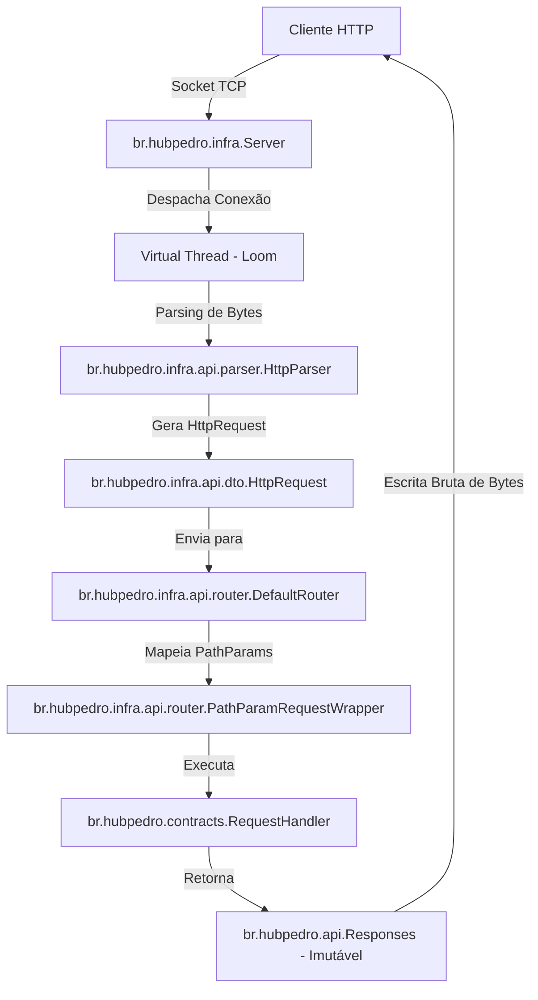

# 🚀 FastAPI-like Java Framework (Loom Sandbox)

> **"E se a ergonomia e simplicidade do FastAPI do Python existissem no ecossistema Java moderno, sem a complexidade pesada do Spring ou Jakarta EE?"**

Este projeto é uma biblioteca Java extremamente elegante, inspirada diretamente na ergonomia minimalista e declarativa do **FastAPI**, mas construída de forma puramente idiomática para o **Java 21+**, aproveitando o poder das **Virtual Threads (Project Loom)** sob um servidor HTTP nativo construído do zero com sockets de alta performance.

---

## 🎨 O Que Torna Este Projeto Incrível?

1. **Ergonomia Minimalista e Pública**: Esqueça anotações complexas, reflexão pesada e XMLs. Todo o runtime interno de infraestrutura (`infra`) está completamente encapsulado. Você interage apenas com a fachada pública super limpa `FastApi` e o criador de respostas imutáveis `Responses`.
2. **Project Loom & Virtual Threads**: Cada conexão de cliente é recebida por um accept-loop assíncrono e imediatamente despachada como uma tarefa em um executor de Virtual Threads (`Executors.newVirtualThreadPerTaskExecutor()`). Zero bloqueio de Threads do S.O.!
3. **Desligamento Gracioso (Graceful Shutdown)**: O servidor implementa proteção avançada de ciclo de vida com locks de reentrada e um mecanismo de desligamento gracioso que aguarda as requisições em andamento por até 10 segundos antes de liberar as portas do sistema operacional de forma limpa.
4. **Respostas 100% Imutáveis**: O contrato `contracts.HttpResponse` é totalmente imutável, garantindo segurança sob concorrência e prevenindo mutações de estado pós-construção dos cabeçalhos e payloads. Cabeçalhos de segurança essenciais (`X-Content-Type-Options`, `X-Frame-Options`, `X-XSS-Protection`) são injetados automaticamente.
5. **Roteamento Inteligente com Especificidade**:
   - **Sem Sombreamento de Rotas**: Um sistema de ordenação automática baseado na especificidade dos segmentos garante que rotas estáticas exatas (ex: `/items/search`) sejam resolvidas prioritariamente em relação a rotas dinâmicas genéricas (ex: `/items/{id}`), independente da ordem em que foram registradas!
   - **Tratamento de 405 Method Not Allowed**: Se um caminho for solicitado com um método HTTP não suportado (ex: `POST` em `/users` quando há apenas `GET`), o roteador devolve `405` populando o cabeçalho `Allow` de forma automática e padrão.
   - **Escape Seguro de Regex**: Caracteres especiais em caminhos estáticos como `.` ou `+` são escapados automaticamente no mapeamento regex interno para evitar falsos positivos de casamento de rotas.
6. **Parser HTTP Resiliente (UTF-8 sem Travamentos)**:
   - Leituras de corpos (`body`) e cabeçalhos baseadas estritamente em **fluxo de bytes brutos** e não em buffers de caracteres.
   - Trata acentos e emojis 🚀 de forma perfeita contando os bytes exatos anunciados pelo `Content-Length`, eliminando de vez hangs por leituras parciais e travamento de conexões.
   - Limites integrados de proteção contra Denial of Service (DoS): Cabeçalhos de no máximo 8KB e corpo de requisição limitado a 10MB.

---

## ⚡ Exemplo de Código (`Main.java`)

Veja como a escrita de uma API HTTP em Java ficou simples, limpa e extremamente similar à experiência do FastAPI no Python:

```java
package br.hubpedro;

import br.hubpedro.api.FastApi;
import br.hubpedro.api.Responses;
import br.hubpedro.contracts.HttpServer;
import br.hubpedro.contracts.Router;

public class Main {
    public static void main(String[] args) {
        System.out.println("=== Inicializando o FastAPI-Java (Loom Sandbox) ===");

        // 1. Instanciamos o roteador dinâmico através da fachada pública
        Router router = FastApi.newRouter();

        // 2. Registramos os endpoints de forma declarativa e com respostas imutáveis
        
        // Rota Estática: Home (Retorna HTML)
        router.get("/", request -> Responses.builder()
                .status(200)
                .header("Content-Type", "text/html; charset=UTF-8")
                .body("<h1>🚀 FastAPI Java com Virtual Threads está rodando!</h1>")
                .build()
        );

        // Rota Dinâmica com Path Parameters e Query Parameters: /items/{id}
        router.get("/items/{id}", request -> {
            String id = request.getPathParams().get("id");
            String q = request.getQueryParams().getOrDefault("q", "nenhum");
            
            // Geramos uma resposta JSON contendo dados da URL, Query e da Virtual Thread atual!
            String jsonResponse = String.format(
                    "{\n  \"item_id\": \"%s\",\n  \"query\": \"%s\",\n  \"executed_by_thread\": \"%s\"\n}",
                    id, q, Thread.currentThread()
            );

            return Responses.json(jsonResponse);
        });

        // Rota POST com leitura segura de corpo (Body) em bytes: /items
        router.post("/items", request -> {
            String body = request.getBody();
            
            String jsonResponse = String.format(
                    "{\n  \"message\": \"Item recebido e persistido com sucesso!\",\n  \"data\": %s,\n  \"executed_by_thread\": \"%s\"\n}",
                    body.isBlank() ? "\"{}\"" : body, Thread.currentThread()
            );

            return Responses.builder()
                    .status(201)
                    .header("Content-Type", "application/json; charset=UTF-8")
                    .body(jsonResponse)
                    .build();
        });

        // 3. Inicializamos o servidor HTTP rodando com Virtual Threads na porta 8080
        HttpServer server = FastApi.newServer(router);
        
        // Gancho para desligar o servidor graciosamente no encerramento da JVM
        Runtime.getRuntime().addShutdownHook(new Thread(() -> {
            System.out.println("\nEncerramento solicitado. Desligando o servidor...");
            server.stop();
        }));

        server.start(8080);
        
        // Aguarda a terminação do servidor de forma limpa para manter a JVM ativa
        server.awaitTermination();
    }
}
```

---

## 🛠️ Suíte de Testes Confiável

Para assegurar que o framework seja robusto, desenvolvemos testes automatizados cobrindo três grandes frentes:

*   **`RouterTest`**: Valida a precedência de rotas (rotas estáticas registradas posteriormente sendo resolvidas antes de dinâmicas genéricas), escape de regex, exceções para registros duplicados, retorno correto de `405 Method Not Allowed` com cabeçalho `Allow` e injeção de parâmetros dinâmicos em qualquer implementação de request.
*   **`HttpParserAndResponseTest`**: Testa o parser HTTP com corpos contendo emojis e acentos em UTF-8 usando a contagem exata de bytes, além de validar os limites máximos DoS para headers (8KB) e bodies (10MB), bem como a imutabilidade estrita dos mapas de cabeçalhos de resposta.
*   **`ServerIntegrationTest`**: Um teste de integração real que levanta o servidor HTTP sob portas dinâmicas livres da máquina local e efetua chamadas reais de rede via conexões TCP manuais por sockets, assegurando o comportamento do pipeline completo.

---

## 🚀 Como Executar o Projeto

Certifique-se de estar utilizando o **Java 21** ou superior em sua máquina.

### Compilar o projeto
```bash
mvn clean compile
```

### Executar a suíte de testes
```bash
mvn test
```

### Rodar a aplicação de exemplo
Basta executar a classe principal `br.hubpedro.Main`. Com o servidor rodando, abra o seu navegador e acesse:
- Página inicial: [http://localhost:8080/](http://localhost:8080/)
- Endpoint Dinâmico (Path e Query Params): [http://localhost:8080/items/42?q=computador](http://localhost:8080/items/42?q=computador)

---

## 📦 Detalhes Técnicos de Infraestrutura (Ocultos ao Usuário)

Abaixo, a arquitetura interna que faz toda a mágica acontecer sob o capô:



---
Desenvolvido com carinho para explorar o futuro do desenvolvimento web leve em Java! 🚀💻
